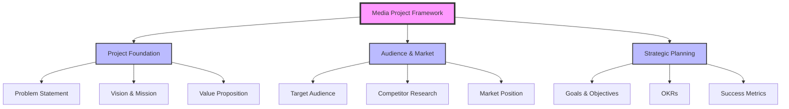
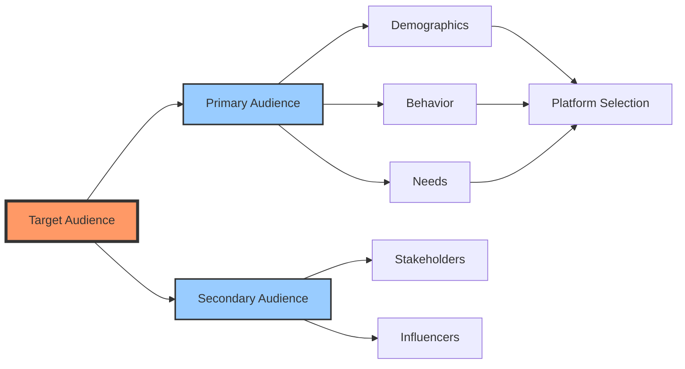
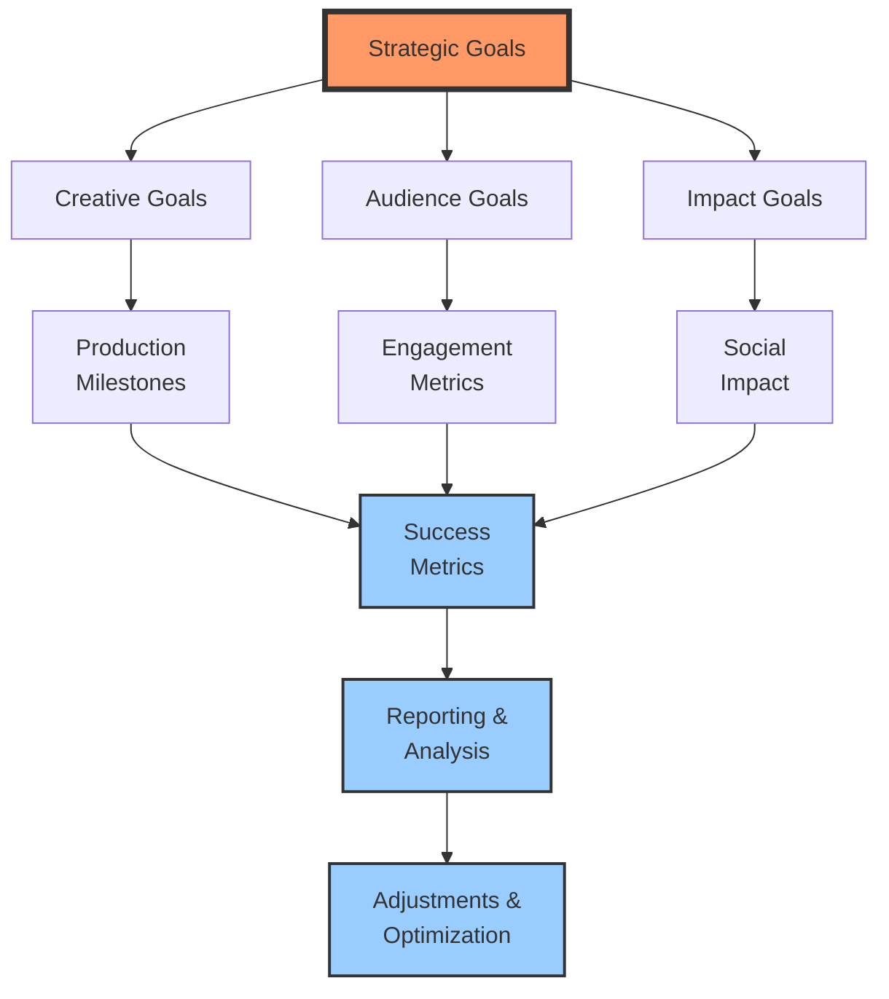
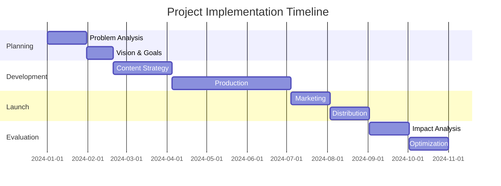
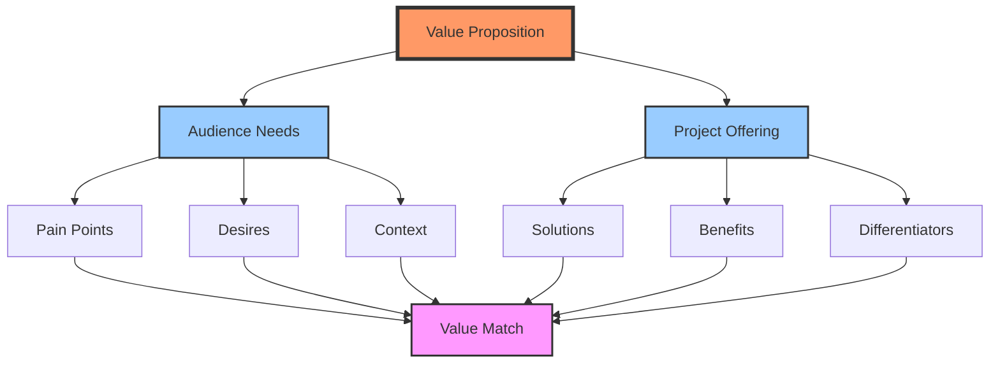

# Project Visualizations

This document provides visual representations of key concepts and frameworks used in media project planning and execution.

## Project Framework Overview

This diagram shows the high-level structure of the media project framework and its main components:

## Audience Analysis Flow

This diagram illustrates the process of analyzing and understanding your target audience:

## Strategic Goals and Metrics Flow

This diagram shows how different types of goals connect to metrics and optimization:

## Project Timeline

This Gantt chart shows a typical project implementation timeline:

## Value Proposition Canvas

This diagram illustrates how project offerings align with audience needs:

## Using These Visualizations

These diagrams serve multiple purposes:

1. **Project Planning**: Use them as templates to map out your project components
2. **Stakeholder Communication**: Share them to explain project structure and flow
3. **Progress Tracking**: Reference them to ensure all aspects are being addressed
4. **Team Alignment**: Use them to keep everyone focused on the same goals

Feel free to adapt and modify these diagrams to better suit your specific project needs. 